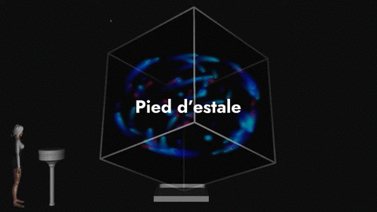

# workshop_installation_interactive_2020
This repo holds the code and documentation for the creative coding workshop @lecolededesign. Production were made by students in 4nd year of interaction design using [Touch Designer](https://derivative.ca/). The **code** is available [github](https://github.com/AtelierNum/workshop_installation_interactive_2020)

Full videos are available [here](https://github.com/AtelierNum/workshop_installation_interactive/releases/tag/1.0).

This workshop was hosted by [Benjamin Carrier](https://www.instagram.com/benjarier/)

Cette page regroupe les projets réalisés par les étudiants de troisième année en design d'interaction @lecolededesign, ce workshop a été l'ocasion de découvrir [Touch Designer](https://derivative.ca/). Le code est disponnible sur [github](https://github.com/AtelierNum/workshop_code_creatif_1920)

L'ensemble des vidéos de présentation des projets est disponible [ici](https://github.com/AtelierNum/workshop_installation_interactive/releases/tag/1.0)

Ce workshop a été encadré par [Benjamin Carrier](https://www.instagram.com/benjarier/)

---
## A-bis

Réalisé par : Marie Jollivet, Hugo Prevost, Clara Mahe, Noémie El kholti.

Nous avons imaginé une installation interactive qui s'implante dans un espace public, de type gare, et serait accessible à tout public. En effet elle s’adresse à différentes personnes, de tout âge, afin d’initier à l’art interactif. Nous souhaitons proposer un univers singulier.

Sur le thème des fonds marins, nous allons mettre en place un écran au sol indiquant, de façon aléatoire, des cercles sur lesquels les utilisateurs pourront se placer afin de faire apparaître des formes sur l’écran de projection se situant en face d’eux.

Les formes représentées sont des formes organiques de sorte à accentuer l’univers du fond marin. En effet, ces formes abstraites rappellent celles des coraux marins.

De plus à chaque fois qu’une forme apparaît sur l’écran de projection, un son se déclenche. Ce dernier variera en fonction de la taille de la personne se situant sur le cercle au sol : plus la personne sera grande, plus le son sera aigu. De cette façon, c’est la taille des personnes qui produit l’interaction sonore.

[Cahier de recherche](https://github.com/AtelierNum/workshop_installation_interactive_2020/blob/master/A-bis/documentation.pdf)

[Présentation](https://github.com/AtelierNum/workshop_installation_interactive_2020/blob/master/A-bis/presentation.pdf)

---
## Nosc

Réalisé par : Raphaël Perraud, Théo Geiller, Elliot Chevalier, Ronan Chopineaux.

Nous avons travaillé sur une installation interactive qui serait controllée par le téléphone du visiteur.

Celui-ci aura la possibilité en entrant dans le dispositif de connecter son téléphone pour envoyer au programme des données provenant de l'accéléromètre. 

Ces données seront alors utiliser pour moduler l'environnement sonore et musical contrôllé par Abbleton Live ainsi que la projection générée par Touch Designer.

[Présentation](https://github.com/AtelierNum/workshop_installation_interactive_2020/blob/master/Nosc/presentation.pdf)

---
## Pied d'estale

Réalisé par : Julie Thierry, Léa Genais, Luna Martel et Juliette Herlem.

Plusieurs personnes peuvent interagir avec le cube en touchant les différents capteurs NFC présents autour du cube (sur des piliers). À cet instant, l'une des lettres filantes se rapproche du visiteur puis se dissipe de façon à avoir l'impression que celle-ci s'est infiltrée dans le téléphone du visiteur. Il reçevra un message "Dans 24 heure, vous recevrez une lettre de M.Dupui. ", puis le lendemain, celle-ci se débloquera. Il aura ainsi la possibilité de voir la lettre d'origine, le texte retapé à l'ordi, le contexte de la lettre, la traduction et enfin il a aussi la possibilité de l'écouter et de la partager.

La réception des lettres est possible par plusieurs moyens : des particuliers qui envoient leurs lettres mais aussi des lettres célèbres qu'on peut retrouver dans des musées, etc …

[Cahier de recherche](https://github.com/AtelierNum/workshop_installation_interactive_2020/blob/master/Pied_d_estale/documentation.pdf)

[Présentation](https://github.com/AtelierNum/workshop_installation_interactive_2020/blob/master/Pied_d_estale/presentation.pdf)

---
## Ilot

Réalisé par : Ulysse Ducamp, Arslan Sifaoui, Robin Exbrayat-Daunay, Lingyi Xia, Yuxiang Li. 

Dans un musée , un lieu de passage, ou un lieu de rencontre ou de repos, cette installation prend la forme d'une banquette monumentale structurant l'espace.

Le dispositif est entièrement génératif. L'utilisateur est acteur de la modification des motifs : la position sur l'assise correspond à une modification d'un paramètre de l'algorithme et l'intensité de la modification dépend du nombre de personnes assises.

[Présentation](https://github.com/AtelierNum/workshop_installation_interactive_2020/blob/master/Ilot/presentation.pdf)

---
## Musicae

Réalisé par : Jeanne Verstraete, Aurore Tanguy, Marie Sandevoir et Meriem Gharbi.

Notre projet consiste à faire une scénographie pour un concert de musique classique. Nous avons cherché à augmenter l’expérience qu’on aurait pu avoir dans une salle comme un opéra ou un théâtre.

On s’est demandé comment assister un orchestre et accompagné la musique ? Comment donner une expérience plus mémorable, plus forte ?

Avec nos veilles et nos recherches, on c’est rendu compte que donner une impression d’animation à 360° serait un bon de moyen d’arriver à notre objectif.

Pour meneer le projet, on choisit la Valse “Waltz No. 2” de Dimitri Chostakovich. C’est une musique très connue dansante et très rythmée.

[Présentation](https://github.com/AtelierNum/workshop_installation_interactive_2020/blob/master/Ilot/presentation.pdf)

